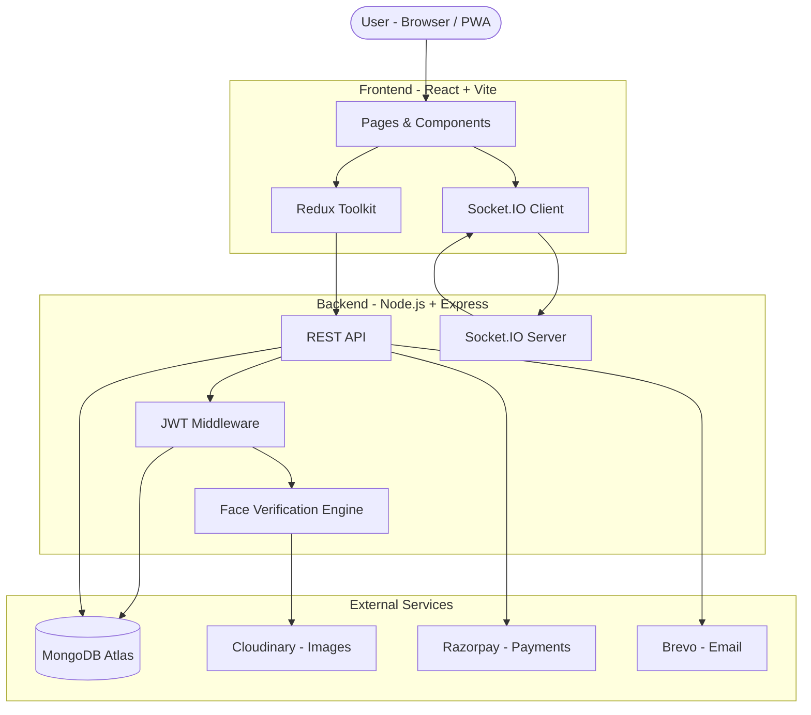

<div align="center">


# Roomezy

**Find rooms. Find roommates. Know exactly who you're dealing with.**

[](https://roomezy.vercel.app)
[](./LICENSE)
[](https://react.dev)
[](https://nodejs.org)
[](https://mongodb.com)

[Live App](https://roomezy.vercel.app) · [GitHub](https://github.com/Aman-ydav/roomezy) · [Report a Bug](https://github.com/Aman-ydav/roomezy/issues) · [Contact](mailto:roomezyy@gmail.com)

</div>

---

## The Problem

Finding a room or roommate online has always carried an uncomfortable question: **who is this person actually?**

Existing platforms let anyone create an account with a phone number and post a listing in minutes. There is no way to know if the photos are real, if the owner is who they claim to be, or if the person moving into your flat has any accountability. Stories of scam listings, fake identities, and unsafe living situations are common across every major rental platform in India.

**Roomezy solves this with independent identity verification.** Before a user's listing ranks high in search results, or before a renter decides to visit a property, they can see exactly what Roomezy has confirmed about that person — directly on their post, in the chat header, and on their profile.

This is not a trust score or a self-reported badge. Roomezy runs its own verification: government ID matched against a live selfie, confirmed independently by our system, and permanently tied to the account. No human sees your photos. The result is a visible, clickable badge that tells every visitor on the platform exactly how much has been verified.

---

## Why Roomezy?

| | Feature | What it means for you |
|---|---|---|
| 🛡 | **Independent Verification** | We match your face to your government ID ourselves. The badge on your profile is our confirmation, not yours. |
| 🏷 | **Trust Badge System** | Every post, chat, and profile shows a 3-state badge at a glance. Green means fully verified. |
| 💬 | **Real-Time Chat** | Socket-powered messaging with typing indicators, online presence, and smart notification suppression. |
| 📊 | **Smart Feed** | Posts are scored and ranked by location, budget, recency, and verification status — not just newest first. |
| 💳 | **Fair Monetisation** | Free to search, free to start posting. Owners get 5 free listings. Credits (₹49) and verification (₹99) are one-time. |
| 🔔 | **Notification Center** | Real-time in-app notifications for messages, verification status, and credits — with full CRUD controls. |
| 🔒 | **Production Security** | JWT auth on every route and socket, rate limiting, HMAC payment verification, and email gate on posting. |
| 📱 | **PWA Ready** | Installable on mobile, works offline for cached content, push notifications via service worker. |

---

## Architecture



---

## Features

### 🛡 Independent Identity Verification

Roomezy runs its own two-step verification process — no third-party KYC service, no outsourced checks.

**Step 1 — Face Match (free, up to 3 attempts)**
The user submits a live selfie and a government-issued ID (Aadhaar, PAN, or Passport). Roomezy's system compares the two using facial descriptor matching — entirely in-memory, on-server. No human reviews the photos. If the faces match, the account moves to "awaiting payment."

**Step 2 — One-time activation (₹99)**
A ₹99 payment via Razorpay permanently activates the verified badge on the account. No subscription, no renewal. The user has 3 days from a successful match to complete payment; after that, the match resets and they can resubmit.

**Three badge states appear everywhere — posts, chat, profile:**

```
🟢  Green (filled)   →  Email confirmed + face/ID match verified
🟡  Amber (filled)   →  Email confirmed, identity check pending
⚫  Gray  (outline)  →  Account created, no verifications yet
```

Every badge is clickable. A popup shows the exact verification status for that user — what was checked and what wasn't.

---

### 🏷 Trust Badge System

The `TrustBadge` component renders on:
- Every post card (top-right corner of the listing image)
- Post detail page (next to the owner's name)
- Chat conversation list and chat header
- User profile and dashboard

The badge is consistent across the entire product. One glance tells the viewer exactly how much has been independently confirmed about that person.

---

### 💳 Post Credit System

Designed for property owners. Room seekers and flatmate seekers can post without limits.

- **5 free listings** for owners (lifetime total, including archived posts)
- **₹49 per additional post credit** — buy any quantity, credits never expire
- Credits are deducted server-side at the moment of post creation
- Dashboard shows remaining credit balance and a "Buy Credits" shortcut
- Verified owners rank higher in the feed — verification has a direct business benefit

---

### 💬 Real-Time Chat

- Socket.IO messaging with sub-second delivery
- Typing indicators per conversation
- Online presence indicator (green dot) tracked per-user across multiple tabs
- Push notifications via service worker when the browser is in the background
- Smart suppression: in-app and push notifications do not fire when the conversation is already open
- Message deletion for yourself or for everyone (within 1 hour)

---

### 🔔 Notification Center

Built from scratch in V2 with full real-time and persistence.

- Bell icon with unread count badge in the navbar
- Dropdown with scrollable list and pinned header controls
- **Per-item actions**: mark as read, delete
- **Bulk actions**: mark all read, delete all
- Notification types: new message, verification confirmed, credits added
- Real-time via `new-notification` socket event; 60-second polling as fallback

---

### 📊 Smart Recommendation Feed

Posts are scored per logged-in user before being returned:

| Signal | Points |
|---|---|
| Location matches user's preferred area | +40 |
| Rent is within user's stated budget | +30 |
| Posted within last 30 days (linear decay) | up to +20 |
| Post has additional photos | +5 |
| Owner is verified by Roomezy | +20 |
| Post average rating | up to +10 |

A verified owner's listing ranks noticeably higher than an equivalent unverified one — making verification worth completing for owners who want visibility.

---

### 🔍 Search & Filters

- Full-text search across title, description, and location (MongoDB `$text` index)
- Filter by post type (room available, looking for roommate, looking for room)
- Filter by status and rent range
- Geospatial proximity search when location coordinates are available
- Sort by newest, oldest, price ascending/descending
- Custom-built dropdown filter components — clean selected state, no library quirks

---

### 📱 Dashboard

- Overview of active posts and account status
- Credit balance display for owners
- Verification status banner — prompts users to complete KYC if pending
- Quick links to edit posts, create new listings, and view chat

---

### 🔒 Security & Trust

| Layer | What's implemented |
|---|---|
| **JWT Authentication** | Every protected REST route and every socket connection requires a valid JWT. Tokens are verified server-side — the socket never trusts a userId from the event payload. |
| **Email Verification Gate** | Users cannot create a post until their email address is confirmed. Google sign-in is auto-verified. |
| **Independent Verification** | Face descriptor matching runs on-server. No external KYC vendor. Photos are processed in-memory and not written to permanent storage. |
| **Razorpay Signature Verification** | Every payment is verified server-side using HMAC-SHA256 before any DB update happens. The frontend never decides whether a payment succeeded. |
| **Rate Limiting** | Auth endpoints: 10 req / 15 min. Post creation: 10 / hr. Verification: 3 / 24 hr. Payments: 20 / hr. General API: 150 / 15 min. |
| **Conversation Ownership** | Chat controllers verify the requesting user is a participant of the conversation before returning any data. |
| **Security Headers** | `helmet` sets CSP, HSTS, and cross-origin headers in production. |
| **Secure File Uploads** | Multer validates file type and size before any processing. Images are stored in Cloudinary, not on the server filesystem. |

---

## What's New in V2

V2 is not an incremental update — it adds the entire trust, monetisation, and real-time notification layer that was missing in V1.

| Category | V1 | V2 |
|---|---|---|
| Identity verification | Not present | Independent face + ID matching, 3-state badge on every post |
| Payments | Not present | Razorpay — verification (₹99) and post credits (₹49) |
| Post limits | Unlimited for all | 5 free for owners, then credit-gated |
| Notification center | Not functional | Full CRUD with real-time socket + polling |
| Push notifications | Fired regardless of context | Suppressed when conversation is open |
| Recommendation feed | Newest first | Scored algorithm with verification boost |
| Security | No rate limiting, no socket auth | Per-endpoint limiters, JWT-authenticated sockets |
| Email gate | Not enforced | Required before posting |
| Trust marketing | Not present | First-visit modal, "Why trust us?" CTA, About and Help pages updated |

---

## Core User Flows

### Room Seeker

```
1. Sign up with email or Google
2. Verify email (or auto-verified via Google)
3. Browse the feed — every listing shows the owner's trust badge
4. Click any badge to see exactly what Roomezy has confirmed about that owner
5. Filter by location, rent, room type, and preferences
6. Start a conversation — see online status in real-time
7. Optional: complete your own verification to increase your credibility with owners
```

### Property Owner

```
1. Sign up → verify email
2. Create your first post (up to 5 are free)
3. Complete identity verification (₹99 one-time) to rank higher in search results
4. Your listing shows the green verified badge — renters can immediately see your credibility
5. Manage posts from the dashboard: toggle active/archived, edit details
6. When you hit the 5-post limit, purchase post credits (₹49 each) to keep listing
7. Receive real-time notifications when renters message you
```

---

## Tech Stack

### Frontend
| | |
|---|---|
| React 19 + Vite | UI framework and build tooling |
| Redux Toolkit | Global state: auth, posts, chat, UI queues |
| Tailwind CSS + shadcn/ui | Utility-first styling and accessible component primitives |
| Framer Motion | Page and component animations |
| Socket.IO Client | Real-time messaging and notification events |
| Axios | HTTP client with automatic token refresh interceptors |
| Razorpay Checkout | Payment modal loaded via CDN |
| Lucide React | Icon library |
| Sonner | Toast notifications |

### Backend
| | |
|---|---|
| Node.js + Express | REST API server |
| Socket.IO | WebSocket layer for chat and notifications |
| Mongoose | MongoDB ODM |
| `@vladmandic/face-api` | Face descriptor extraction and comparison (WASM, runs in Node) |
| Razorpay SDK | Payment order creation and HMAC-SHA256 signature verification |
| `express-rate-limit` | Per-route request throttling |
| Multer | Multipart file upload handling |
| Cloudinary SDK | Image upload and URL management |
| Nodemailer + Brevo | Transactional email delivery |
| `node-cron` | Hourly job to expire unconfirmed verification matches |

### Database
| | |
|---|---|
| MongoDB Atlas | Primary database |
| Indexes | `2dsphere` for geo, `$text` for search, compound indexes on messages and conversations |

### Infrastructure
| | |
|---|---|
| Render | Backend hosting (Node.js service) |
| Vercel | Frontend hosting with edge CDN |
| Cloudinary | Image CDN and storage |
| MongoDB Atlas | Managed database with free tier |

---

## Getting Started

### Prerequisites

- Node.js 18+
- MongoDB Atlas account (free tier is fine) or local MongoDB
- Cloudinary account (free tier)
- Razorpay account — use test keys for development, no real charges
- Brevo account (free tier) for transactional email

### 1. Clone the repository

```bash
git clone https://github.com/Aman-ydav/roomezy.git
cd roomezy
```

### 2. Backend setup

```bash
cd backend
npm install
```

Create `backend/.env`:

```env
# Server
PORT=8000
NODE_ENV=development

# Database
MONGODB_URI=your_mongodb_connection_string

# Authentication
ACCESS_TOKEN_SECRET=change_this_to_a_long_random_string
REFRESH_TOKEN_SECRET=change_this_to_another_long_random_string

# Google OAuth
GOOGLE_CLIENT_ID=
GOOGLE_CLIENT_SECRET=

# Cloudinary
CLOUDINARY_CLOUD_NAME=
CLOUDINARY_API_KEY=
CLOUDINARY_API_SECRET=

# Email — Brevo
BREVO_API_KEY=
EMAIL_FROM=noreply@roomezy.com

# Razorpay — NEVER commit the secret
RAZORPAY_KEY_ID=rzp_test_xxxx
RAZORPAY_KEY_SECRET=your_razorpay_key_secret

# CORS
CORS_ALLOWED_ORIGINS=http://localhost:5173

# Push notifications (Web Push VAPID)
VAPID_PUBLIC_KEY=
VAPID_PRIVATE_KEY=
```

```bash
npm run dev
# API running at http://localhost:8000
```

### 3. Frontend setup

```bash
cd ../frontend
npm install
```

Create `frontend/.env`:

```env
VITE_API_URL=http://localhost:8000/api/v1
VITE_SOCKET_URL=http://localhost:8000
VITE_GOOGLE_CLIENT_ID=your_google_client_id
VITE_RAZORPAY_KEY_ID=rzp_test_xxxx
```

```bash
npm run dev
# App running at http://localhost:5173
```

> **Security note:** `RAZORPAY_KEY_SECRET` must only ever appear in `backend/.env`. Never put it in the frontend `.env` or commit it to version control. The frontend only needs the public `RAZORPAY_KEY_ID`.

---

## Deployment

### Backend → Render

1. Push to GitHub
2. Create a new **Web Service** in Render, connect your repository
3. Set **Build Command**: `npm install` and **Start Command**: `node src/index.js`
4. Add all backend `.env` variables in Render's **Environment** tab
5. Face verification models load from `node_modules/@vladmandic/face-api/model` — no extra setup needed

### Frontend → Vercel

1. Import your repository in Vercel
2. Set **Framework Preset** to Vite
3. Add all `VITE_*` environment variables in Vercel's project settings
4. `VITE_RAZORPAY_KEY_ID` is safe to add here — it is the public key only

---

## Roadmap

These are features planned or in progress for future versions.

- [ ] **Chat request system** — first message to an owner creates a request (pending / accepted / declined) rather than an open conversation immediately
- [ ] **Read receipts** — single tick (sent), double tick (delivered), blue double tick (read)
- [ ] **Message reply / quote** — long-press to quote a previous message
- [ ] **Saved posts** — bookmark listings and receive notifications when they update
- [ ] **Owner ratings** — renters can rate an owner after moving out
- [ ] **Verified photo** — owners can mark listing photos as taken by themselves
- [ ] **Advanced geosearch** — radius slider on the map, distance shown on each card
- [ ] **Preference matching** — smoker / non-smoker, pets, LGBTQ+ friendly, schedule compatibility
- [ ] **Mobile apps** — React Native clients for iOS and Android

---

## Contributing

Contributions are welcome. To get started:

1. Fork the repository
2. Create a feature branch: `git checkout -b feature/your-feature-name`
3. Make your changes and commit with a clear message
4. Open a pull request against `main` describing what you changed and why

For significant changes, open an issue first to discuss the approach.

Please do not commit secrets, credentials, or `.env` files. The `.gitignore` is set up to prevent this, but double-check before pushing.

---

## License

This project is licensed under the [MIT License](./LICENSE).

---

## Author

**Aman Yadav**
Full-stack developer, built Roomezy from a real problem — the experience of finding a room in a new city with no way to verify who you were dealing with.

- Portfolio: [portfolioamanydav.vercel.app](https://portfolioamanydav.vercel.app)
- Email: [roomezyy@gmail.com](mailto:roomezyy@gmail.com)
- GitHub: [@Aman-ydav](https://github.com/Aman-ydav)

---

<div align="center">

**Roomezy — because who you live with matters as much as where you live.**

</div>
